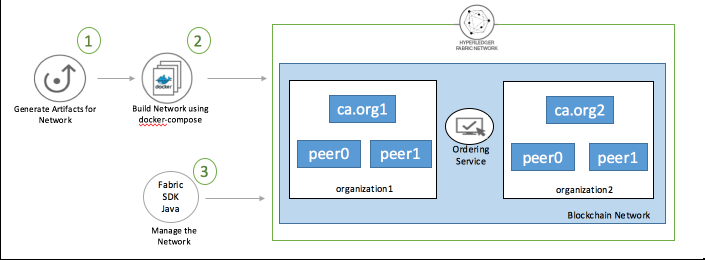

# Create and Deploy a Blockchain Network using Hyperledger Fabric SDK Java

Blockchain is a shared, immutable ledger for recording the history of transactions. The Linux Foundation’s Hyperledger Fabric, the software implementation of blockchain IBM is committed to, is a permissioned network. Hyperledger Fabric is a platform for distributed ledger solutions underpinned by a modular architecture delivering high degrees of confidentiality, resiliency, flexibility and scalability.

In a Blockchain solution, the Blockchain network works as a back-end with an application front-end to communicate with the network using a SDK. To set up the communication between front-end and back-end, Hyperledger Fabric community offers a number of SDKs for a wide variety of programming languages like the NodeJS SDK and Java SDK. This code pattern explains the methodology to create, deploy and test the blockchain network using Hyperledger Fabric SDK Java.

It would be helpful for the Java developers, who started to look into Hyperledger Fabric platform and would like to use Fabric SDK Java for their projects. The SDK helps facilitate Java applications to manage the lifecycle of Hyperledger channels and user chaincode. The SDK also provides a means to execute user chaincode, query blocks and transactions on the channel, and monitor events on the channel. This code pattern will help to get the process started to build a Hyperledger Fabric v1.1 Java application.

When the reader has completed this pattern, they will understand how to create, deploy and test a blockchain network using Hyperledger Fabric SDK Java. This pattern will provision a Hyperledger Fabric 1.1 network consisting of two organizations, each maintaining two peer node, two certificate authorities (ca) for each organization and a solo ordering service. The following aspects will be demonstrated in this code pattern:
* Create and initialize channel
* Install and instantiate chain code
* Register and enroll the users
* Perform invoke and query on the blockchain network.

> **Note:** This code pattern builds a Hyperledger Fabric 1.1 network and uses Hyperledger Fabric SDK java 1.0.0 .

## Flow

   

1. Generate the artifacts using cryptogen and configtx for peers and channel in network. Currently these are already generated and provided in the code repository to use as-is.
2. Build the network using docker-compose and the generated artifacts.
3. Use Hyperledger Fabric Java SDK APIs to work with and manage the network.
    * Create and initialize the channel
    * Install and instantiate the chaincode
    * Register and enroll the users
    * Perform invoke and query to test the network


## Included Components

* [Hyperledger Fabric](https://hyperledger-fabric.readthedocs.io/): Hyperledger Fabric is a platform for distributed ledger solutions underpinned by a modular architecture delivering high degrees of confidentiality, resiliency, flexibility and scalability.

* [Docker](https://www.docker.com/): Docker is an open platform for developers and sysadmins to build, ship, and run distributed applications.

* [Hyperledger Fabric Java SDK](https://github.com/hyperledger/fabric-sdk-java)

## Featured Technologies

* [Blockchain](https://en.wikipedia.org/wiki/Blockchain): A blockchain is a digitized, decentralized, public ledger of all transactions in a network.

* [Java](https://en.wikipedia.org/wiki/Java_(programming_language)): Java is a general-purpose computer-programming language that is concurrent, class-based and object-oriented.

## Watch the Video
[](https://youtu.be/vCTabgkvfS0)]

## Pre-requisites

* [Docker](https://www.docker.com/get-started) - v1.13 or higher
* [Docker Compose](https://docs.docker.com/compose/overview/) - v1.8 or higher
* [Git Client](https://git-scm.com/downloads) - needed for clone commands
* [Maven](https://maven.apache.org/download.cgi) - needed to build the client. Maven is a build automation tool used primarily for Java projects. Maven addresses two aspects of building software: first, it describes how software is built, and second, it describes its dependencies.

## Steps

Follow these steps to setup and run this code pattern.

1. [Setup the Blockchain Network](#1-setup-the-blockchain-network)
2. [Build the client based on Fabric Java SDK](#2-build-the-client-based-on-fabric-java-sdk)
3. [Create and Initialize the channel](#3-create-and-initialize-the-channel)
4. [Deploy and Instantiate the chaincode](#4-deploy-and-instantiate-the-chaincode)
5. [Register and enroll users](#5-register-and-enroll-users)
6. [Perform Invoke and Query on network](#6-perform-invoke-and-query-on-network)

### 1. Setup the Blockchain Network

[Clone this repo](https://github.com/IBM/blockchain-application-using-fabric-java-sdk) using the following command.

```
$ git clone https://github.com/IBM/blockchain-application-using-fabric-java-sdk
```

To build the blockchain network, the first step is to generate artifacts for peers and channels using cryptogen and configtx. The utilities used and steps to generate artifacts are explained [here](https://hyperledger-fabric.readthedocs.io/en/release-1.1/build_network.html). In this pattern all required artifacts for the peers and channel of the network are already generated and provided to use as-is. Artifacts can be located at:

   ```
   network_resources/crypto-config
   network_resources/config
   ````

The automated scripts to build the network are provided under `network` directory. The `network/docker-compose.yaml` file defines the blockchain network topology. This pattern provisions a Hyperledger Fabric 1.1 network consisting of two organizations, each maintaining two peer node, two certificate authorities for each organization and a solo ordering service. Need to run the script as follows to build the network.

> **Note:** Please clean up the old docker images (if any) from your environment otherwise you may get errors while setting up network.

   ```
   cd network
   chmod +x build.sh
   ./build.sh
   ```

To stop the running network, run the following script.

   ```
   cd network
   chmod +x stop.sh
   ./stop.sh
   ```

To delete the network completely, following script need to execute.

   ```
   cd network
   chmod +x teardown.sh
   ./teardown.sh
   ```

### 2. Build the client based on Fabric Java SDK

The previous step creates all required docker images with the appropriate configuration.

**Java Client**
* The java client sources are present in the folder `java` of the repo.
* Check your environment before executing the next step. Make sure, you are able to run `mvn` commands properly.
   > If `mvn` commands fails, please refer to [Pre-requisites](#pre-requisites) to install maven.


To work with the deployed network using Hyperledger Fabric SDK java 1.0.0, perform the following steps.

* Open a command terminal and navigate to the `java` directory in the repo. Run the command `mvn install`.

   ```
   cd ../java
   mvn install
   ```

* A jar file `blockchain-java-sdk-0.0.1-SNAPSHOT-jar-with-dependencies.jar` is built and can be found under the `target` folder. This jar can be renamed to `blockchain-client.jar` to keep the name short.

   ```
   cd target
   cp blockchain-java-sdk-0.0.1-SNAPSHOT-jar-with-dependencies.jar blockchain-client.jar
   ```

* Copy this built jar into `network_resources` directory. This is required as the java code can access required artifacts during execution.

   ```
   cp blockchain-client.jar ../../network_resources
   ```

### 3. Create and Initialize the channel

In this code pattern, we create one channel `mychannel` which is joined by all four peers. The java source code can be seen at  `src/main/java/org/app/network/CreateChannel.java`. To create and initialize the channel, run the following command.

   ```
   cd ../../network_resources
   java -cp blockchain-client.jar org.app.network.CreateChannel
   ```

Output:

   ```Apr 20, 2018 5:11:42 PM org.app.util.Util deleteDirectory
      INFO: Deleting - users
      Apr 20, 2018 5:11:45 PM org.app.network.CreateChannel main
      INFO: Channel created mychannel
      Apr 20, 2018 5:11:45 PM org.app.network.CreateChannel main
      INFO: peer0.org1.example.com at grpc://localhost:7051
      Apr 20, 2018 5:11:45 PM org.app.network.CreateChannel main
      INFO: peer1.org1.example.com at grpc://localhost:7056
      Apr 20, 2018 5:11:45 PM org.app.network.CreateChannel main
      INFO: peer0.org2.example.com at grpc://localhost:8051
      Apr 20, 2018 5:11:45 PM org.app.network.CreateChannel main
      INFO: peer1.org2.example.com at grpc://localhost:8056
   ```

### 4. Deploy and Instantiate the chaincode

This code pattern uses a sample chaincode `fabcar` to demo the usage of Hyperledger Fabric SDK Java APIs. To deploy and instantiate the chaincode, execute the following command.

   ```
   java -cp blockchain-client.jar org.app.network.DeployInstantiateChaincode
   ```

   Output:

   ```Apr 23, 2018 10:25:22 AM org.app.client.FabricClient deployChainCode
      INFO: Deploying chaincode fabcar using Fabric client Org1MSP admin
      Apr 23, 2018 10:25:22 AM org.app.network.DeployInstantiateChaincode main
      INFO: fabcar- Chain code deployment SUCCESS
      Apr 23, 2018 10:25:22 AM org.app.network.DeployInstantiateChaincode main
      INFO: fabcar- Chain code deployment SUCCESS
      Apr 23, 2018 10:25:22 AM org.app.client.FabricClient deployChainCode
      INFO: Deploying chaincode fabcar using Fabric client Org2MSP admin
      Apr 23, 2018 10:25:22 AM org.app.network.DeployInstantiateChaincode main
      INFO: fabcar- Chain code deployment SUCCESS
      Apr 23, 2018 10:25:22 AM org.app.network.DeployInstantiateChaincode main
      INFO: fabcar- Chain code deployment SUCCESS
      Apr 23, 2018 10:25:22 AM org.app.client.ChannelClient instantiateChainCode
      INFO: Instantiate proposal request fabcar on channel mychannel with Fabric client Org2MSP admin
      Apr 23, 2018 10:25:22 AM org.app.client.ChannelClient instantiateChainCode
      INFO: Instantiating Chaincode ID fabcar on channel mychannel
      Apr 23, 2018 10:25:25 AM org.app.client.ChannelClient instantiateChainCode
      INFO: Chaincode fabcar on channel mychannel instantiation java.util.concurrent.CompletableFuture@723ca036[Not completed]
      Apr 23, 2018 10:25:25 AM org.app.network.DeployInstantiateChaincode main
      INFO: fabcar- Chain code instantiation SUCCESS
      Apr 23, 2018 10:25:25 AM org.app.network.DeployInstantiateChaincode main
      INFO: fabcar- Chain code instantiation SUCCESS
      Apr 23, 2018 10:25:25 AM org.app.network.DeployInstantiateChaincode main
      INFO: fabcar- Chain code instantiation SUCCESS
      Apr 23, 2018 10:25:25 AM org.app.network.DeployInstantiateChaincode main
      INFO: fabcar- Chain code instantiation SUCCESS
   ```

   > **Note:** The chaincode fabcar.go was taken from the fabric samples available at - https://github.com/hyperledger/fabric-samples/tree/release-1.1/chaincode/fabcar/go.

### 5. Register and enroll users

A new user can be registered and enrolled to an MSP. Execute the below command to register a new user and enroll to Org1MSP.

   ```
   java -cp blockchain-client.jar org.app.user.RegisterEnrollUser
   ```

   Output:

   ```Apr 23, 2018 10:26:34 AM org.app.util.Util deleteDirectory
      INFO: Deleting - users
      log4j:WARN No appenders could be found for logger (org.hyperledger.fabric.sdk.helper.Config).
      log4j:WARN Please initialize the log4j system properly.
      log4j:WARN See https://logging.apache.org/log4j/1.2/faq.html#noconfig for more info.
      Apr 23, 2018 10:26:35 AM org.app.client.CAClient enrollAdminUser
      INFO: CA -http://localhost:7054 Enrolled Admin.
      Apr 23, 2018 10:26:35 AM org.app.client.CAClient registerUser
      INFO: CA -http://localhost:7054 Registered User - user1524459395783
      Apr 23, 2018 10:26:36 AM org.app.client.CAClient enrollUser
      INFO: CA -http://localhost:7054 Enrolled User - user1524459395783
   ```

### 6. Perform Invoke and Query on network

Blockchain network has been setup completely and is ready to use. Now we can test the network by performing invoke and query on the network. The `fabcar` chaincode allows us to create a new asset which is a car. For test purpose, invoke operation is performed to create a new asset in the network and query operation is performed to list the asset of the network. Perform the following steps to check the same.

   ```
   java -cp blockchain-client.jar org.app.chaincode.invocation.InvokeChaincode
   ```

   Output:

   ```Apr 20, 2018 5:13:03 PM org.app.client.CAClient enrollAdminUser
     INFO: CA -http://localhost:7054 Enrolled Admin.
     Apr 20, 2018 5:13:04 PM org.app.client.ChannelClient sendTransactionProposal
     INFO: Sending transaction proposal on channel mychannel
     Apr 20, 2018 5:13:04 PM org.app.client.ChannelClient sendTransactionProposal
     INFO: Transaction proposal on channel mychannel OK SUCCESS with transaction
     id:a298b9e27bdb0b6ca18b19f9c78a5371fb4d9b8dd199927baf37379537ca0d0f
     Apr 20, 2018 5:13:04 PM org.app.client.ChannelClient sendTransactionProposal
     INFO:
     Apr 20, 2018 5:13:04 PM org.app.client.ChannelClient sendTransactionProposal
     INFO: java.util.concurrent.CompletableFuture@22f31dec[Not completed]
     Apr 20, 2018 5:13:04 PM org.app.chaincode.invocation.InvokeChaincode main
     INFO: Invoked createCar on fabcar. Status - SUCCESS
  ```

   ```
   java -cp blockchain-client.jar org.app.chaincode.invocation.QueryChaincode
   ```

   Output:

   <pre>
    Apr 20, 2018 5:13:28 PM org.app.client.CAClient enrollAdminUser
    INFO: CA -http://localhost:7054 Enrolled Admin.
    Apr 20, 2018 5:13:29 PM org.app.chaincode.invocation.QueryChaincode main
    INFO: <b>Querying for all cars ...</b>
    Apr 20, 2018 5:13:29 PM org.app.client.ChannelClient queryByChainCode
    INFO: Querying queryAllCars on channel mychannel
    Apr 20, 2018 5:13:29 PM org.app.chaincode.invocation.QueryChaincode main
    INFO: <b>[{"Key":"CAR1", "Record":{"make":"Chevy","model":"Volt","colour":"Red","owner":"Nick"}}]</b>
    Apr 20, 2018 5:13:39 PM org.app.chaincode.invocation.QueryChaincode main
    INFO: <b>Querying for a car - CAR1</b>
    Apr 20, 2018 5:13:39 PM org.app.client.ChannelClient queryByChainCode
    INFO: Querying queryCar on channel mychannel
    Apr 20, 2018 5:13:39 PM org.app.chaincode.invocation.QueryChaincode main
    INFO: <b>{"make":"Chevy","model":"Volt","colour":"Red","owner":"Nick"}</b>
   </pre>

## Troubleshooting

[See DEBUGGING.md.](DEBUGGING.md)

## License
This code pattern is licensed under the Apache Software License, Version 2.  Separate third party code objects invoked within this code pattern are licensed by their respective providers pursuant to their own separate licenses. Contributions are subject to the [Developer Certificate of Origin, Version 1.1 (DCO)](https://developercertificate.org/) and the [Apache Software License, Version 2](https://www.apache.org/licenses/LICENSE-2.0.txt).

[Apache Software License (ASL) FAQ](https://www.apache.org/foundation/license-faq.html#WhatDoesItMEAN)

